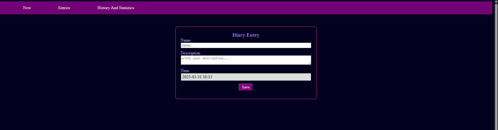
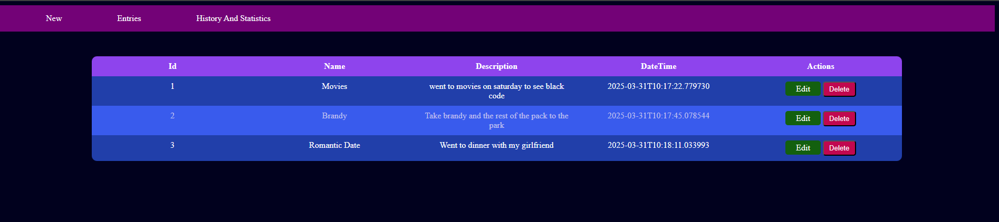
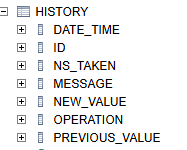
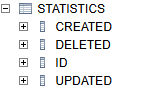
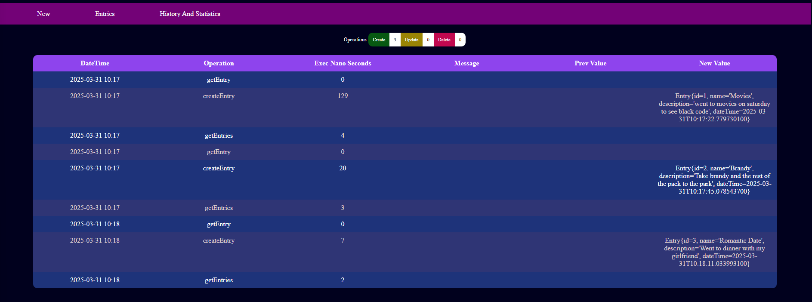

# Demo Spring AOP

This is simple App to record diary activities. An Activity is composes by:

1. **Name**
2. **Description**
3. **Date Time**

The app runs in port 8080 [App](http://localhost:8080/). It allows to create new diary entries.



List all the entries so far and the chance to edit or delete an activity.



## Stack

The app was build using the following stack:

1. Spring boot 3.4.4
2. Spring JPA
3. Spring Web
4. Spring thymeleaf
5. Spring validation
6. Spring AOP
7. h2 _(for in memory Database)_

## AOP implementation

Every operation in the app is logged to two different places:

1. **History:** Record all the CRUD operations done over the diary entries.

    

2. **Statistics:** Count the modification operations performed,

    

These history and statistics operation can be seem in the [historyAndStatistics](historyAndStatistics) option.



## Spring AOP Concepts

On this app the _AOP_ concepts applied were:
  
1. **Aspect:** We have an _aspect_ class called [Logging](https://github.com/jiujitsuboy/SpringAOP/blob/master/AOPDemo/src/main/java/com/reailize/AOPDemo/Aspect/Logging.java) which have all the logging rules to record the _history_ and _statictis_ data.
2. **PointCuts:** We have a set of _point cuts in the class [LoggingPointCut](https://github.com/jiujitsuboy/SpringAOP/blob/master/AOPDemo/src/main/java/com/reailize/AOPDemo/PointCut/LoggingPointCut.java) where all the filters to applied the _aspect_ are defined.
3. **Advice:** In class [Logging](https://github.com/jiujitsuboy/SpringAOP/blob/master/AOPDemo/src/main/java/com/reailize/AOPDemo/Aspect/Logging.java) we combine the _pointcuts_ with the _advice_ to applied the _aspect_.

### PointCuts

These are the list of _pointcuts_ defined:

1. **diaryServiceMethodExecution:** Using _within_ we match every method on the [DiaryService](https://github.com/jiujitsuboy/SpringAOP/blob/master/AOPDemo/src/main/java/com/reailize/AOPDemo/Service/DiaryService.java) service.
2. **diaryServiceModifyExecution:** Using _within_ in combination with _!execution_ we filter the Create, Update and Delete operations from [DiaryService](https://github.com/jiujitsuboy/SpringAOP/blob/master/AOPDemo/src/main/java/com/reailize/AOPDemo/Service/DiaryService.java) service
3. **diaryServiceReadMethodExecution:** Using _within_ in combination with _execution_ we filter the Get operations from [DiaryService](https://github.com/jiujitsuboy/SpringAOP/blob/master/AOPDemo/src/main/java/com/reailize/AOPDemo/Service/DiaryService.java) service
4. **diaryControllerMethod:** Using _execution_ we get the _handleForm_ action from the [Diary Controller](https://github.com/jiujitsuboy/SpringAOP/blob/master/AOPDemo/src/main/java/com/reailize/AOPDemo/Controller/DiaryController.java) controller.
5. **diaryServiceCreateMethod:** We reuse the pointcut diaryServiceMethodExecution() plus the _@annotation_ definition to get all the actions from [DiaryService](https://github.com/jiujitsuboy/SpringAOP/blob/master/AOPDemo/src/main/java/com/reailize/AOPDemo/Service/DiaryService.java) service that use the annotation [CreateEntry](https://github.com/jiujitsuboy/SpringAOP/blob/master/AOPDemo/src/main/java/com/reailize/AOPDemo/Annotation/CreateEntry.java)
6. **diaryServiceUpdateMethod:** We reuse the pointcut diaryServiceMethodExecution() plus the _@annotation_ definition to get all the actions from [DiaryService](https://github.com/jiujitsuboy/SpringAOP/blob/master/AOPDemo/src/main/java/com/reailize/AOPDemo/Service/DiaryService.java) service that use the annotation [UpdateEntry](https://github.com/jiujitsuboy/SpringAOP/blob/master/AOPDemo/src/main/java/com/reailize/AOPDemo/Annotation/UpdateEntry.java)
7. **diaryServiceWithParameterLong:** We reuse the pointcut diaryServiceMethodExecution() plus the _args_ definition to get all the actions from [DiaryService](https://github.com/jiujitsuboy/SpringAOP/blob/master/AOPDemo/src/main/java/com/reailize/AOPDemo/Service/DiaryService.java) service that receive as arguments a _Long_ type.


### Advices

Using above _pointcuts_ to filter where to apply the advice. We have the following _advice_ used.

1. **@Around("com.reailize.AOPDemo.PointCut.LoggingPointCut.diaryServiceReadMethodExecution()"):** Record execution time for Read Operations on [DiaryService](https://github.com/jiujitsuboy/SpringAOP/blob/master/AOPDemo/src/main/java/com/reailize/AOPDemo/Service/DiaryService.java) service.
2. **@Around("com.reailize.AOPDemo.PointCut.LoggingPointCut.diaryServiceCreateMethod()"):** Record execution time and Entries values for Create Operation on [DiaryService](https://github.com/jiujitsuboy/SpringAOP/blob/master/AOPDemo/src/main/java/com/reailize/AOPDemo/Service/DiaryService.java) service.
3. **@Around("com.reailize.AOPDemo.PointCut.LoggingPointCut.diaryServiceUpdateMethod()"):** Record execution time and Entries values for Update Operation on [DiaryService](https://github.com/jiujitsuboy/SpringAOP/blob/master/AOPDemo/src/main/java/com/reailize/AOPDemo/Service/DiaryService.java) service.
4. **@Around("com.reailize.AOPDemo.PointCut.LoggingPointCut.diaryServiceWithParameterLong()"):** Record execution time and Entries values for Delete Operation on [DiaryService](https://github.com/jiujitsuboy/SpringAOP/blob/master/AOPDemo/src/main/java/com/reailize/AOPDemo/Service/DiaryService.java) service.
5. **@Around("com.reailize.AOPDemo.PointCut.LoggingPointCut.diaryServiceWithParameterLong()"):** Get if the handleForm was called for Create or Update.
6. **@AfterThrowing(pointcut = "com.reailize.AOPDemo.PointCut.LoggingPointCut.diaryServiceReadMethodExecution()", throwing = "ex"):** Capture any exception thrown during Read operations on [DiaryService](https://github.com/jiujitsuboy/SpringAOP/blob/master/AOPDemo/src/main/java/com/reailize/AOPDemo/Service/DiaryService.java) service.
7. **@AfterReturning("com.reailize.AOPDemo.PointCut.LoggingPointCut.diaryServiceWithParameterLong()"):** Increase the statistic counter for delete operation on [DiaryService](https://github.com/jiujitsuboy/SpringAOP/blob/master/AOPDemo/src/main/java/com/reailize/AOPDemo/Service/DiaryService.java) service.
8. **@After("com.reailize.AOPDemo.PointCut.LoggingPointCut.diaryServiceCreateMethod() || com.reailize.AOPDemo.PointCut.LoggingPointCut.diaryServiceUpdateMethod()"):** Increase the statistic counter for create or update operation on [DiaryService](https://github.com/jiujitsuboy/SpringAOP/blob/master/AOPDemo/src/main/java/com/reailize/AOPDemo/Service/DiaryService.java) service.

## Spring AOP Receipt

The idea of this demo was to put in practice the majority of the Spring AOP concepts, but obviously not all was cover here. Following we can see a receipt of how to create a cross-cutting concern using AOP.

### Step 1

Define you _cross-cutting concern_. This mean, define what is the logic you want to apply by implementing a set of _Aspects_. Following the topic of this demo, our cross-cutting concern is _logging user operations_.

Your _cross-cutting concern_ will be encapsulated in a class annotated with **@Aspect**.

```
@Aspect
@Component
public class Logging {}

```

### Step 2

Once you have the _cross-cutting concern_ (your Aspect or set of Aspects) is time to define what are the operations this _Aspect_ will have.
Following the topic of this demo, we are interested in logging CRUD operations by recording the execution time and any model parameters.

```
    public Object logExecutionTimeForReadOperations(ProceedingJoinPoint proceedingJoinPoint) throws Throwable {}

    public Object logExecutionTimeForCreateOperations(ProceedingJoinPoint proceedingJoinPoint) throws Throwable {}

    public Object logExecutionTimeFoUpdateOperations(ProceedingJoinPoint proceedingJoinPoint) throws Throwable {}
    
    public Object logExecutionTimeForDeleteOperations(ProceedingJoinPoint proceedingJoinPoint) throws Throwable {}

    public void verifyTypeOfOperationToPerformOnHandleForm(JoinPoint joinPoint) {}

    public void expectationOnReadOperation(JoinPoint joinPoint, RuntimeException ex) {}
    
    public void verifyTypeOfOperationToPerformOnWithParameterLong(JoinPoint joinPoint) {}

    public void countModificationOperations(JoinPoint joinPoint) {}
```
### Step 3

Now that you have you _Aspect_ with all the methods containing the _cross-cutting concern_ is it time to define two things:

1. The filter (_Point Cut_) to hook our Aspect methods to the **join point** where we want to apply the logic.
2. In want moment of the request, we want to apply the logic (our _Advice_).

We can create _Advices_ with _Point Cut_ on the same place by annotating our _Aspect Methods_ with the selected _Advice_ plus de _Point Cut_ definition.

```
  //As an example we select the @Around Advice for logging updates operations.
  
  @Around("within(com.reailize.AOPDemo.Service.DiaryService) && @annotation(com.reailize.AOPDemo.Annotation.UpdateEntry)")
  public Object logExecutionTimeFoUpdateOperations(ProceedingJoinPoint proceedingJoinPoint) throws Throwable {}
```

As you may tell, is a lot of sintax to define the _Point Cut_ and following this approach, if we need to reuse any of the _Point Cut definition_, will need to duplicate the statement.
So for this purpose is better to create the _Point Cuts_ as reusable functions in another class.

```
   public class LoggingPointCut {

    //Get all method from DiaryService
    @Pointcut("within(com.reailize.AOPDemo.Service.DiaryService)")
    public void diaryServiceMethodExecution() {}

    //Get create, update and delete methods from DiaryService
    @Pointcut("within(com.reailize.AOPDemo.Service.DiaryService) && !execution(* com.reailize.AOPDemo.Service.DiaryService.get*(..))")
    public void diaryServiceModifyExecution() {}

    //Get all read methods (getEntries, getEntry) from DiaryService
    @Pointcut("diaryServiceMethodExecution() && execution(* com.reailize.AOPDemo.Service.DiaryService.get*(..))")
    public void diaryServiceReadMethodExecution() {}

    //Get handleForm endpoint from DiaryController
    @Pointcut("execution(* com.reailize.AOPDemo.Controller.DiaryController.handleForm(..))")
    public void diaryControllerMethod() {}

    //Get createEntry from DiaryService
    @Pointcut("diaryServiceMethodExecution() && " +
            "@annotation(com.reailize.AOPDemo.Annotation.CreateEntry)")
    public void diaryServiceCreateMethod() {}

    //Get updateEntry from DiaryService
    @Pointcut("diaryServiceMethodExecution() && " +
            "@annotation(com.reailize.AOPDemo.Annotation.UpdateEntry)")
    public void diaryServiceUpdateMethod() {}

    //Get DeleteEntry from  DiaryService
    @Pointcut("diaryServiceModifyExecution() && args(Long)")
    public void diaryServiceWithParameterLong(){}
}
```

Then we can reference them by qualified name in the _Advice_ definition like this.

```
    //Using the previous Advice @Around for logging updates operations.
     @Around("com.reailize.AOPDemo.PointCut.LoggingPointCut.diaryServiceUpdateMethod()")
    public Object logExecutionTimeFoUpdateOperations(ProceedingJoinPoint proceedingJoinPoint) throws Throwable {}

```

### Step 4

Implement the logic of each method in the _Aspect_ class according to the type of Advise selected. This is the code that will be trigger
on the set of _Join Point_ that our _Point_ Cuts fill filter.

```
    //Adding the logic to our previous method for loggin udpates operations
    
    @Around("com.reailize.AOPDemo.PointCut.LoggingPointCut.diaryServiceUpdateMethod()")
    public Object logExecutionTimeFoUpdateOperations(ProceedingJoinPoint proceedingJoinPoint) throws Throwable {
        String operation = proceedingJoinPoint.getSignature().getName();

        Entry entry = (Entry) proceedingJoinPoint.getArgs()[0];
        String prevEntry = diaryService.getEntry(entry.getId()).toString();

        long startTime = System.nanoTime();

        Object returnValue = proceedingJoinPoint.proceed();

        long endTime = System.nanoTime(); // End time
        long executionTime = (endTime - startTime) / 1_000_000;

        History history = createHistoryRecord(operation, executionTime, prevEntry, returnValue.toString(), null);

        historyService.createHistory(history);

        return returnValue;
    }
```


## Spring AOP Reference

Here is the list of Supported **Pointcut Designators**:

- **execution:** Is the most commonly used one. It matches method executions based on the method signature..

- **within:**  Limits matching to methods within a specific type (class) or package.

- **this:** Is used to match proxy objects (Spring-managed beans) that implement a specific interface.

- **target:** Is similar to this, but it matches based on the actual target object (not just the proxy).

- **args:**  Matches methods based on the runtime arguments passed to them.

- **@target:** Is similar to @within, but it considers only the target object.

- **@args:**  Matches methods where the runtime arguments are annotated with a specific annotation.

- **@within:** Matches all methods within classes annotated with a specific annotation.

- **@annotation:** Matches methods that are directly annotated with a specific annotation.

_Point Cuts_ can be combined using the following operators:

1. && (AND)
2. || (OR)
3. ! (NOT)

For more information visite [Spring Pointcuts](https://docs.spring.io/spring-framework/reference/core/aop/ataspectj/pointcuts.html)

Here is the list of Supported **Advises**

- **Before**: Executes before the target method is invoked.
- **AfterReturning**: Executes after the target method completes successfully (i.e., without throwing an exception).
- **AfterThrowing**: Executes if the target method throws an exception.
- **After**: Executes after the target method has finished, regardless of its outcome (whether it returned normally or threw an exception).
- **Around**: Surrounds the target method invocation, meaning it runs both before and after the method execution.

For more information visite [Spring Advises](https://docs.spring.io/spring-framework/reference/core/aop/ataspectj/advice.html)